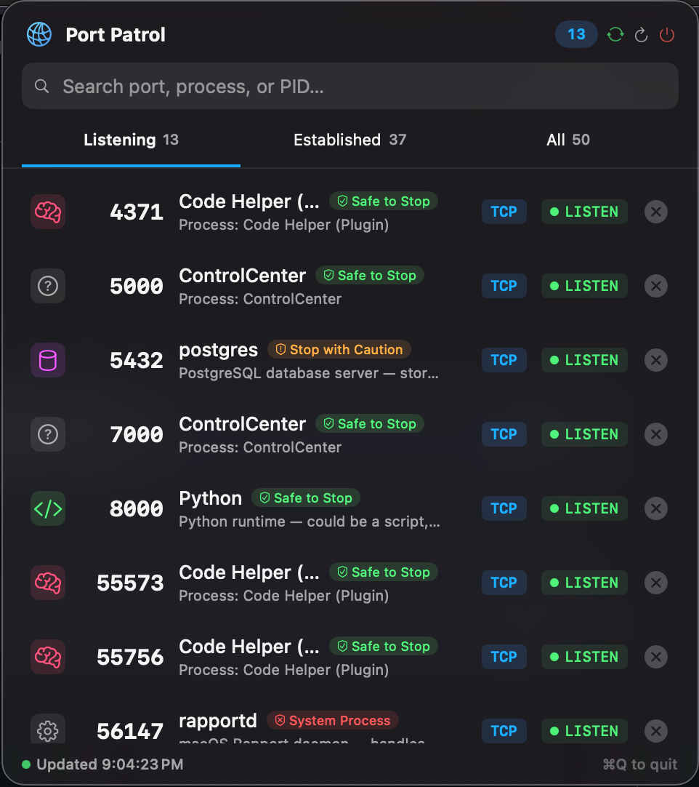
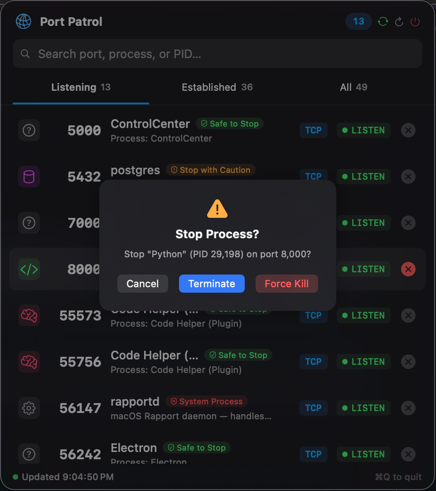

# Port Patrol 🛡️





**Port Patrol** is a native macOS menu bar application that gives you instant visibility into all open network ports and the processes running them. It's designed for developers who need to know *what* is running on port 8080/3000/5432 and *why*.

## Features

- **👀 Real-Time Monitoring**: Sees every open TCP/UDP port on your system.
- **🧠 Process Intelligence**: 
  - Explains **what** a process is (e.g. "PostgreSQL database").
  - Shows **who** started it (parent process detection).
  - Identifies **dependencies** (what other apps are using this process?).
  - Classifies safety: 🟢 Safe to Stop, 🟠 Caution, 🔴 System Process.
- **⚡ Performance Optimized**: Uses intelligent caching and batched system calls to remain lightweight (<1% CPU).
- **🛑 Kill Control**: Terminate processes directly from the menu bar with a robust native system call implementation.
- **🎨 Native UI**: sleek SwiftUI interface with dark mode support.

## Security & Performance Audit

This application has undergone a security and performance review (Feb 2026).

### Security
- **Native System Calls**: Process termination uses `Darwin.kill()` directly, avoiding shell command injection risks.
- **Standard Permissions**: The app runs with user privileges and cannot terminate root/system processes (enforced by macOS kernel).
- **Data Privacy**: All analysis happens locally on-device. No data is sent to any external server.
- **Input Sanitization**: `lsof` and `ps` outputs are parsed using strict string manipulation to prevent buffer issues.

### Performance
- **Smart Caching**: Process details are cached for 30 seconds to prevent redundant system queries.
- **Memory Management**: The cache includes an auto-pruning mechanism that clears stale entries if the cache grows too large (>200 items), ensuring zero long-term memory leaks.
- **Efficient Polling**: Port scanning runs on a background thread and only refreshes active UI components.
- **Batched Execution**: System queries are optimized to fetch necessary data in minimal steps.

## Installation & Building

Port Patrol is a developer tool and is not sandboxed (it requires access to `lsof` and `kill`). Therefore, it cannot be distributed on the App Store.

### Prerequisites
- macOS 14.0 or later
- Xcode 15+

### Build Steps

#### Using Xcode
1. Clone the repository:
   ```bash
   git clone https://github.com/yourusername/port-patrol.git
   cd port-patrol
   ```

2. Open the project in Xcode:
   ```bash
   open PortPatrol.xcodeproj
   ```

3. Build and Run:
   - Select the **PortPatrol** scheme.
   - Press `Cmd + R`.

#### Command Line Build
To quickly verify the build status or perform a clean build from the terminal, use the following command. It outputs only build errors or the final success message:

```bash
xcodebuild -project PortPatrol.xcodeproj -scheme PortPatrol -configuration Debug build 2>&1 | grep -E "error:|BUILD" | tail -5
```

4. (Optional) Archive for local use:
   - Go to `Product -> Archive`.
   - Choose "Distribute App" -> "Copy App".
   - Move `PortPatrol.app` to your `/Applications` folder.

## Troubleshooting

- **"App hangs when clicking Terminate"**: Fixed in v1.1 by replacing native alerts with custom overlays to respect `MenuBarExtra` lifecycle.
- **"Port 8000 not showing"**: Fixed in v1.1 with corrected `lsof` field parsing order.

## License

MIT License. Free to use and modify.


## Troubleshooting

- **"App hangs when clicking Terminate"**: Fixed in v1.1 by replacing native alerts with custom overlays to respect `MenuBarExtra` lifecycle.
- **"Port 8000 not showing"**: Fixed in v1.1 with corrected `lsof` field parsing order.

## License

MIT License. Free to use and modify.
